# Laporan Tugas Pertemuan 3 PBO A - Azzahra Navisha_4525210118

## Java
### Percobaan Langkah 1 (Main.java)
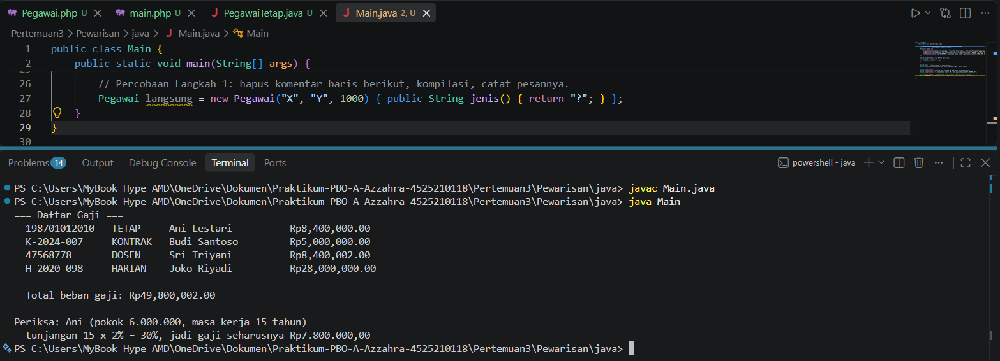
### TODO Langkah 4 (Main.java)
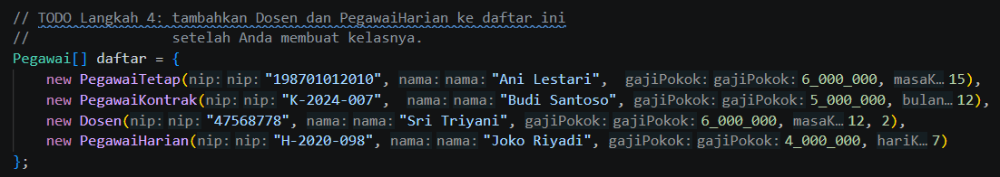
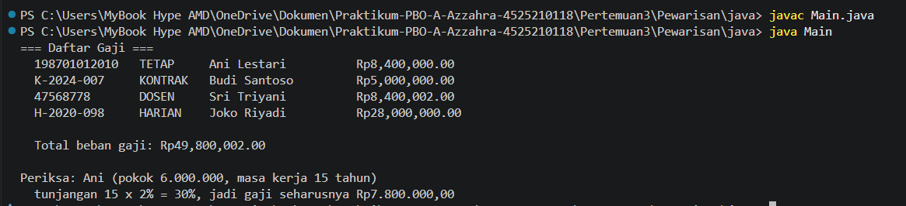
### TODO 1 (Pegawai.java)
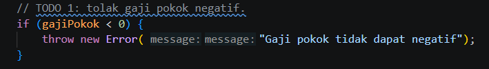
### TODO 2 (Pegawai.java)
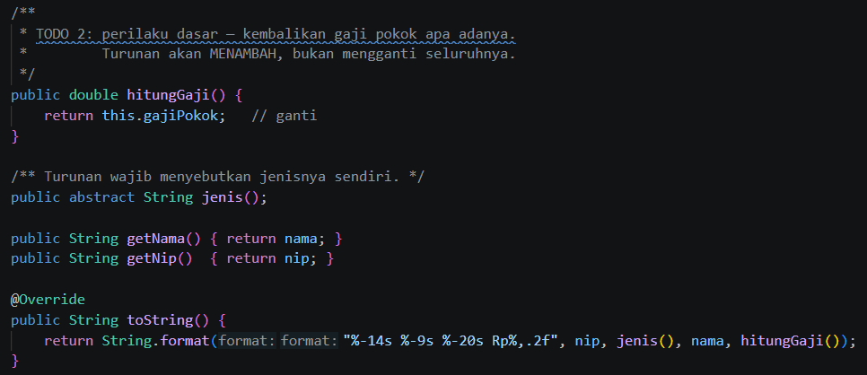
### TODO 1 (PegawaiTetap.java)
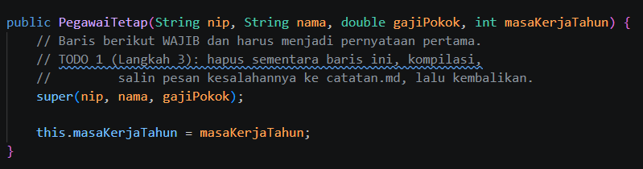
### TODO 2 (PegawaiTetap.java)
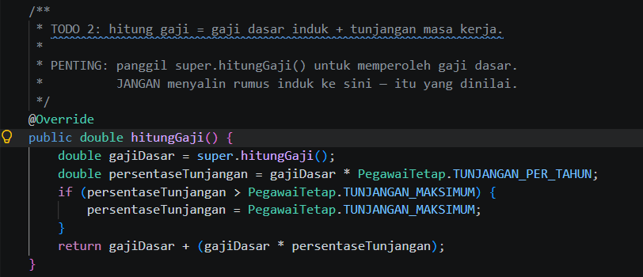
### TODO 2 (PegawaiKontrak.java)
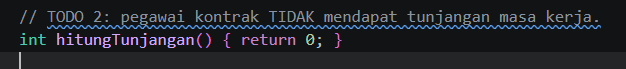
### Apakah method hitungGaji() perlu di-override di sini?
    jawabannya adalah "tidak", karena method hitungGaji() di kelas Pegawai sudah sesuai dengan kebutuhan PegawaiKontrak.
### Program Dosen.java
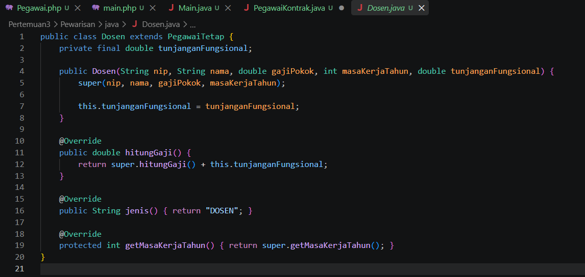
### Program PegawaiHarian.java
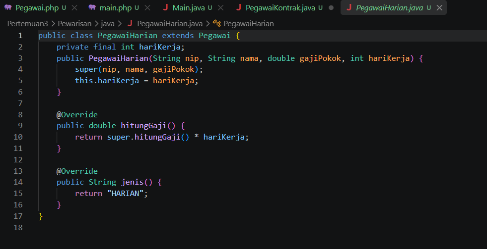
### Hasil Running Program
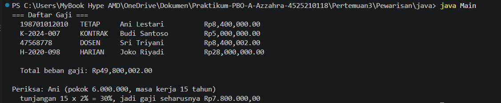

## PHP
### TODO 2 (Pegawai.php)
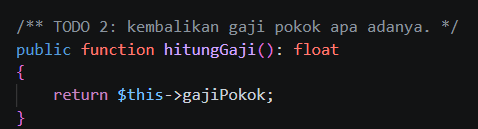
### TODO 3 (Langkah 3) (Pegawai.php)
=== Daftar Gaji ===
  PHP Fatal error:  Uncaught Error: Typed property Pegawai::$nip must not be accessed before initialization in C:\Users\MyBook Hype AMD\OneDrive\Dokumen\Praktikum-PBO-A-Azzahra-4525210118\Pertemuan3\Pewarisan\php\Pegawai.php:43
Stack trace:
#0 C:\Users\MyBook Hype AMD\OneDrive\Dokumen\Praktikum-PBO-A-Azzahra-4525210118\Pertemuan3\Pewarisan\php\main.php(17): Pegawai->__toString()
#1 {main}
  thrown in C:\Users\MyBook Hype AMD\OneDrive\Dokumen\Praktikum-PBO-A-Azzahra-4525210118\Pertemuan3\Pewarisan\php\Pegawai.php on line 43

Fatal error: Uncaught Error: Typed property Pegawai::$nip must not be accessed before initialization in C:\Users\MyBook Hype AMD\OneDrive\Dokumen\Praktikum-PBO-A-Azzahra-4525210118\Pertemuan3\Pewarisan\php\Pegawai.php:43
Stack trace:
#0 C:\Users\MyBook Hype AMD\OneDrive\Dokumen\Praktikum-PBO-A-Azzahra-4525210118\Pertemuan3\Pewarisan\php\main.php(17): Pegawai->__toString()
#1 {main}
  thrown in C:\Users\MyBook Hype AMD\OneDrive\Dokumen\Praktikum-PBO-A-Azzahra-4525210118\Pertemuan3\Pewarisan\php\Pegawai.php on line 43
### TODO 4 (Pegawai.php)
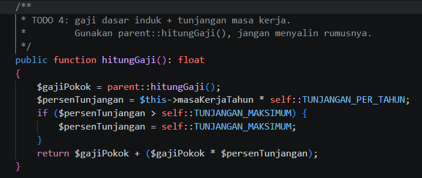
### TODO Langkah 4 (Pegawai.php)
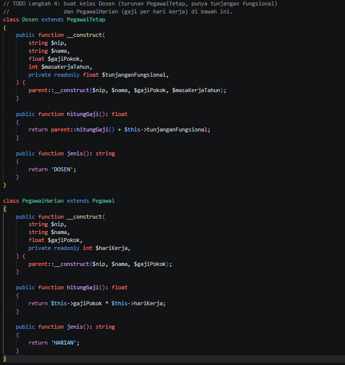
### TODO Langkah 4 (main.php)
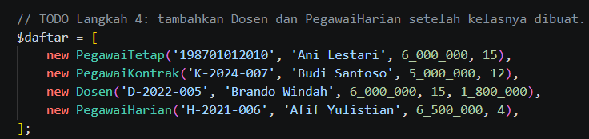
### Hasil Running Program
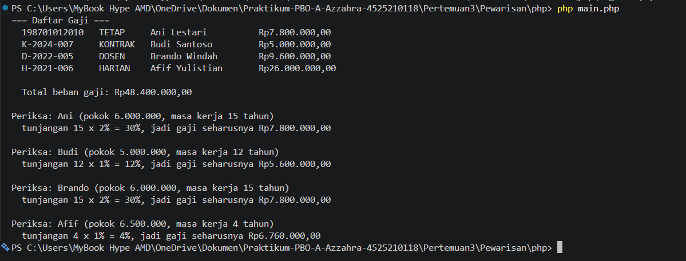